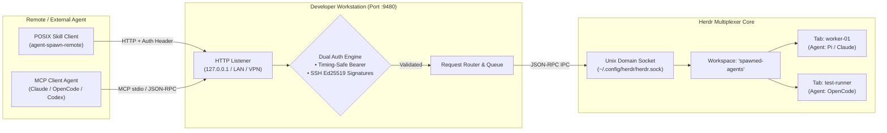

<div align="center">

# Herdr Agent Gateway

**Secure, authenticated remote dispatch plugin, skill, and MCP server for the [Herdr](https://herdr.dev) terminal multiplexer.**

[](LICENSE)
[](https://herdr.dev)
[](flake.nix)
[](https://bun.sh)
[](https://www.typescriptlang.org/)

<p align="center">
  <a href="#-features">Features</a> •
  <a href="#-architecture">Architecture</a> •
  <a href="#-quickstart--installation">Installation</a> •
  <a href="#-usage-reference">Usage</a> •
  <a href="#-declarative-configuration">Configuration</a> •
  <a href="#-security-model">Security</a> •
  <a href="#-license">License</a>
</p>

</div>

---

## 🌟 Overview & Why It Exists

When AI coding agents (Claude Code, OpenCode, Codex, Pi, DSH, Antigravity) run on remote servers, in sandboxes, or across background automation loops, they frequently need to dispatch tasks to a developer's local workstation (e.g. running builds, inspecting hardware, running GUI tests, or spawning subagents).

However, granting remote agents raw SSH access or unconstrained root shells creates massive security risks and clobbers the developer's interactive workspace.

**Herdr Agent Gateway** solves this by exposing a scoped, authenticated control layer for **Herdr**:
1. **Zero Focus Theft**: Spawns tasks inside dedicated terminal tabs in the background without stealing your active typing focus.
2. **Hardened Dual Auth**: Rejects unauthorized access using constant-time Bearer tokens and cryptographic SSH Ed25519 request signatures.
3. **PTY Memory Injection**: Prompts are passed verbatim into the terminal PTY layer without shell expansion or interpolation vulnerabilities.
4. **Autonomous YOLO Mode**: Configures non-interactive flags per agent kind declaratively in `herdr_nodes.json`.

---

## ✨ Features

- 🛡️ **Zero Focus Theft**: Agents launch in background tabs (`focus: false`) inside a dedicated workspace (`spawned-agents`), leaving your active editor session undisturbed.
- ⚡ **Dual Client Interfaces**:
  - **POSIX CLI & Agent Skill**: [`skills/spawn_herdr_agent/`](skills/spawn_herdr_agent/) contains `agent-spawn-remote`, a zero-dependency script for any agent harness.
  - **Model Context Protocol (MCP)**: Native [`packages/mcp-server/`](packages/mcp-server/) exposes gateway tools directly to tool-calling agents.
- 🔐 **Hardened Dual Authentication**:
  - Constant-time string comparison (`crypto.timingSafeEqual`) eliminates timing attacks.
  - SSH Request Signatures verify client identity against `~/.ssh/authorized_keys` with SHA-256 body hashing and a 60-second replay window.
- 🚀 **Declarative YOLO Mode**: Run agents autonomously without confirmation prompts using `--yolo` or `--approval-mode yolo`. Arguments like `--dangerously-skip-permissions` are mapped per agent in `herdr_nodes.json`.
- ❄️ **First-Class Nix & Home Manager Integration**: Full flake support packaging all binaries, runnable apps, devShell, and a declarative Home Manager module with systemd service supervision.
- 🧭 **Multi-Machine Profile Registry**: Automatic machine discovery with fallback order across local workstation, LAN desktops, or remote devboxes.

---

## 🏗️ Architecture & Data Flow



---

## 📦 Quickstart & Installation

### Option 1: Nix Flake & Home Manager (Recommended)

Add `herdr-agent-gateway` to your flake inputs:

```nix
{
  inputs = {
    nixpkgs.url = "github:NixOS/nixpkgs/nixos-unstable";
    herdr-agent-gateway.url = "git+https://gitlab.pikujs.com/pikujs/herdr-agent-gateway.git";
  };
}
```

Enable the service and tools in your Home Manager configuration:

```nix
{ inputs, pkgs, ... }:

{
  imports = [
    inputs.herdr-agent-gateway.homeManagerModules.default
  ];

  services.herdr-agent-gateway = {
    enable = true;           # Enables background systemd user service
    client.enable = true;    # Installs agent-spawn-remote in PATH
    mcpServer.enable = true; # Installs herdr-mcp-server in PATH
    host = "127.0.0.1";
    port = 9480;
    defaultWorkspace = "spawned-agents";

    # Declarative YOLO args per agent
    yoloArgs = {
      pi = [ "--yolo" ];
      claude = [ "--dangerously-skip-permissions" ];
      opencode = [ "--yolo" ];
    };
  };
}
```

### Option 2: Herdr Plugin System

Link or install the plugin directly into your local Herdr multiplexer:

```bash
# Link local checkout as a Herdr plugin
herdr plugin link plugins/herdr-remote-gateway

# Invoke initial setup action (generates tokens and installs systemd user service)
herdr plugin action invoke setup --plugin herdr-remote-gateway
```

### Option 3: Standalone Run via Bun

```bash
# Run server directly with Bun
cd plugins/herdr-remote-gateway
bun install
bun run src/server.ts

# Or run setup helper to install systemd user service
bun run src/cli.ts setup
```

---

## 🛠️ Usage Reference

### 1. POSIX CLI Client (`agent-spawn-remote`)

The client wrapper is located at [`skills/spawn_herdr_agent/scripts/agent-spawn-remote`](skills/spawn_herdr_agent/scripts/agent-spawn-remote) (with a convenient symlink at `scripts/agent-spawn-remote`).

```bash
# Check connectivity & socket status
agent-spawn-remote health

# List active workspaces, panes, or agents
agent-spawn-remote list workspaces
agent-spawn-remote list agents

# Spawn an agent tab in Herdr with an initial prompt
agent-spawn-remote spawn \
  --kind pi \
  --name worker_refactor \
  --workspace spawned-agents \
  --prompt "Analyze project structure and run unit tests"

# Spawn in autonomous YOLO mode (auto-approves tool execution)
agent-spawn-remote spawn \
  --kind claude \
  --name autotask \
  --workspace spawned-agents \
  --yolo \
  --prompt "Fix failing linter errors"

# Read terminal output from a pane
agent-spawn-remote read w15:p1 --lines 50

# Submit follow-up prompt to an active agent
agent-spawn-remote prompt --agent worker_refactor "Run pytest tests/test_api.py" --wait

# Close a finished pane
agent-spawn-remote close w15:p1
```

### 2. Model Context Protocol (MCP Server)

Configure the MCP server in your agent harness (`claude_desktop_config.json`, OpenCode `opencode.json`, or Codex):

```json
{
  "mcpServers": {
    "herdr-gateway": {
      "command": "herdr-mcp-server",
      "env": {
        "HERDR_GATEWAY_TOKEN": "your_bearer_token"
      }
    }
  }
}
```

#### Exposed MCP Tools:
* `herdr_health`: Verify gateway connectivity and Herdr multiplexer status.
* `herdr_list_panes`: List all workspaces, tabs, panes, and running agent sessions.
* `herdr_spawn_agent`: Create a tab, start an agent runtime, and inject initial prompt.
* `herdr_prompt_agent`: Send follow-up instructions to an active named agent.
* `herdr_read_pane`: Read terminal scrollback history from a specific pane.
* `herdr_send_keys`: Send control sequences (`ctrl+c`, `enter`, `escape`) to an agent.
* `herdr_close_pane`: Terminate and close a terminal pane.

### 3. REST API (`curl`)

```bash
# Health check (unauthenticated)
curl -s http://127.0.0.1:9480/api/v1/health

# Spawn agent tab (Bearer token)
curl -s -X POST http://127.0.0.1:9480/api/v1/agents/spawn \
  -H "Authorization: Bearer $(cat ~/.config/herdr/plugins/config/herdr-remote-gateway/gateway.token)" \
  -H "Content-Type: application/json" \
  -d '{
    "agent_kind": "pi",
    "agent_name": "worker_api",
    "workspace": "spawned-agents",
    "yolo": true,
    "prompt": "echo Hello from Remote Agent"
  }'
```

---

## ⚙️ Declarative Configuration

### Node Registry (`herdr_nodes.json`)

The client script and MCP server automatically discover machine profiles in `~/.config/herdr/plugins/config/herdr-remote-gateway/herdr_nodes.json`:

```json
{
  "$schema": "https://raw.githubusercontent.com/pikujs/herdr-agent-gateway/main/schemas/herdr_nodes.schema.json",
  "default_node": "local-workstation",
  "fallback_order": [
    "local-workstation",
    "lan-desktop"
  ],
  "yolo_args": {
    "pi": ["--yolo"],
    "claude": ["--dangerously-skip-permissions"],
    "opencode": ["--yolo"],
    "codex": ["--yolo"],
    "dsh": ["--yolo"],
    "antigravity": ["--yolo"]
  },
  "nodes": {
    "local-workstation": {
      "endpoint": "http://127.0.0.1:9480",
      "auth_token": "env:HERDR_GATEWAY_TOKEN",
      "default_workspace": "spawned-agents",
      "default_agent": "pi",
      "priority": 10
    },
    "lan-desktop": {
      "endpoint": "http://192.168.1.150:9480",
      "auth_token": "env:HERDR_REMOTE_TOKEN",
      "default_workspace": "spawned-agents",
      "default_agent": "claude",
      "priority": 20
    }
  }
}
```

### Environment Variables

| Variable | Type | Default | Description |
|---|---|---|---|
| `HERDR_GATEWAY_HOST` | String | `127.0.0.1` | Bind address. Default localhost; can bind to LAN/VPN IP or `0.0.0.0` when set. |
| `HERDR_GATEWAY_PORT` | Integer | `9480` | Port for the HTTP daemon. |
| `HERDR_GATEWAY_TOKEN` | String | *(None)* | Shared Bearer authentication secret. |
| `HERDR_GATEWAY_TOKEN_FILE` | String | `.../gateway.token` | Path to Bearer token file if not set via environment. |
| `HERDR_GATEWAY_DEFAULT_WORKSPACE` | String | `spawned-agents` | Workspace targeted when caller omits `workspace`. |
| `HERDR_GATEWAY_MAX_PANES` | Integer | `16` | Maximum concurrent active panes (returns `429` if exceeded). |
| `HERDR_SOCKET_PATH` | String | `~/.config/herdr/herdr.sock` | Path to Herdr Unix domain socket. |
| `HERDR_BIN_PATH` | String | `herdr` | Executable path for CLI fallback. |

---

## 🔒 Security Model

1. **Restricted Interface Binding**: Defaults strictly to `127.0.0.1`. Never exposes public interfaces unless explicitly requested via `HERDR_GATEWAY_HOST`.
2. **Constant-Time Authentication**: Token validation uses `crypto.timingSafeEqual()` to protect against timing attacks.
3. **Cryptographic Request Signatures**: SSH signatures require SHA-256 payload digest verification with timestamp freshness validation (max 60 seconds clock drift) against `~/.ssh/authorized_keys`.
4. **PTY Memory Isolation**: Prompts bypass shell expansion and pass directly into Herdr PTY layers as memory strings, preventing shell-injection vulnerabilities.
5. **Input Sanitization**: Enforces strict agent kind whitelisting (`pi`, `claude`, `opencode`, `codex`, `dsh`, `antigravity`), alphanumeric session naming (`^[a-zA-Z0-9_-]{1,64}$`), and a 64KB maximum payload ceiling.

---

## 📁 Repository Structure

```
herdr-agent-gateway/
├── flake.nix                       # Flake packaging (packages, apps, devShells, HM module)
├── flake.lock                      # Pinned Nix lockfile
├── nix/                            # Nix expressions
│   ├── packages.nix                # Derivations for daemon, client, and MCP server
│   └── home-manager-module.nix     # Home Manager service & configuration module
├── templates/                      # Dedicated external templates for service & configs
├── plugins/
│   └── herdr-remote-gateway/       # In-daemon Herdr plugin & HTTP server (Bun / TypeScript)
├── packages/
│   └── mcp-server/                 # Model Context Protocol (MCP) server
├── skills/
│   └── spawn_herdr_agent/          # Agent Skill specification (SKILL.md)
│       └── scripts/                # Canonical client scripts (agent-spawn-remote)
├── scripts/                        # Root convenience symlinks
├── schemas/
│   └── herdr_nodes.schema.json     # Machine profile registry JSON Schema
├── docs/                           # Detailed architecture and API specifications
├── AGENTS.md                       # Machine rules & development instructions
└── HANDOFF.md                      # Implementation roadmap & WBS tracker (OP#358)
```

---

## 📄 License

This project is licensed under the [MIT License](LICENSE) © 2026 pikujs (Nirmaan J Sarkar).
