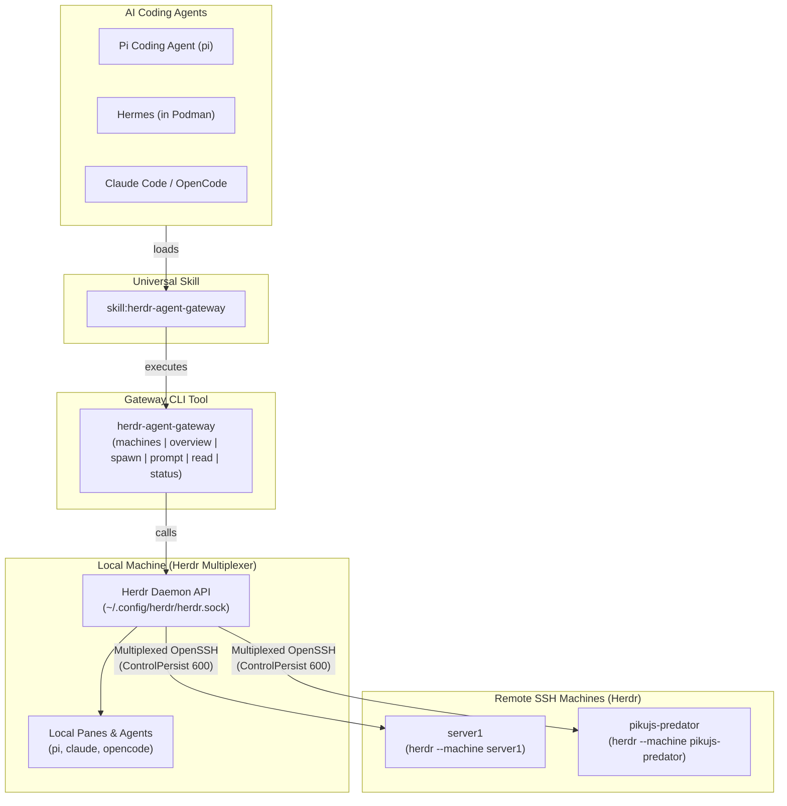

<div align="center">

# Herdr Agent Gateway

**Multi-machine fleet orchestration CLI and universal agent skill for the [Herdr](https://herdr.dev) terminal multiplexer.**

[](LICENSE)
[](https://herdr.dev)
[](flake.nix)
[](https://www.python.org/)

<p align="center">
  <a href="#-overview">Overview</a> •
  <a href="#-architecture">Architecture</a> •
  <a href="#-cli-commands">CLI Commands</a> •
  <a href="#-universal-agent-skill">Agent Skill</a> •
  <a href="#-declarative-nixos--home-manager-configuration">Nix Configuration</a>
</p>

</div>

---

## 🌟 Overview

When coordinating AI coding agents (Pi, Claude Code, OpenCode, Codex, Cursor, Hermes, Antigravity) across multiple machines—local laptops, workstations, GPU boxes, and server instances—knowing which agent is running where, what project directory it occupies, and its execution state is critical.

**Herdr Agent Gateway** provides a unified command-line executable (`herdr-agent-gateway`) and a universal Agent Skill:

1. **Native OpenSSH Multiplexing**: Built directly upon Herdr's native SSH coordination engine (`herdr --machine <target>`). No custom HTTP daemons, no custom listening ports, and no extra tokens to manage.
2. **Cluster-Wide Agent Overview**: Displays all active agents across local and saved SSH machines with agent kind, lifecycle status, workspace label, terminal title, working directory (`cwd`), and task description.
3. **Multi-Machine Agent Spawning & Prompting**: Split panes and launch agents (local or remote) with initial tasks, prompt injection, and screen output reading.
4. **Universal Agent Skill**: A single skill readable by any LLM agent harness (Pi, Hermes, Claude, OpenCode, Antigravity) without needing custom agent-specific plugins.

---

## 🏗️ Architecture



---

## 💻 CLI Commands (`herdr-agent-gateway`)

### 1. List Fleet Machines (`machines`)
```bash
# Formatted table
herdr-agent-gateway machines

# Structured JSON
herdr-agent-gateway machines --json

# Probe live connection status of each node
herdr-agent-gateway machines --probe
```

### 2. Fleet-Wide Agent Overview (`overview`)
```bash
# Pretty terminal overview table
herdr-agent-gateway overview

# Detailed view (includes task description and pane ID)
herdr-agent-gateway overview -d

# Filter by machine
herdr-agent-gateway overview --machine pikujs-server-1

# Structured JSON output
herdr-agent-gateway overview --json
```

### 3. Spawn Agents (`spawn`)
Split a pane and start a coding agent on `local` or any remote machine:
```bash
# Spawn Pi agent locally
herdr-agent-gateway spawn --kind pi --name my-agent --cwd /home/pikujs/Projects/app

# Spawn Claude Code on remote machine with initial prompt and wait:
herdr-agent-gateway spawn \
  --kind claude \
  --name refactor-agent \
  --machine pikujs-server-1 \
  --cwd /srv/projects/api \
  --prompt "Refactor user authentication module" \
  --wait
```

### 4. Inject Prompts (`prompt`)
```bash
herdr-agent-gateway prompt my-agent "Run unit tests and fix errors" --wait
```

### 5. Read Agent Screen (`read`)
```bash
herdr-agent-gateway read my-agent --lines 50
```

### 6. Check Server Daemon Status (`status`)
```bash
herdr-agent-gateway status
herdr-agent-gateway status --machine pikujs-server-1
```

---

## 🧠 Universal Agent Skill

The repository includes a ready-to-use skill at [`skills/herdr-agent-gateway/SKILL.md`](skills/herdr-agent-gateway/SKILL.md).

- **For Pi Coding Agent**: Discovered automatically if placed or linked into `~/.agents/skills/herdr-agent-gateway` or `~/.pi/agent/skills/`.
- **For Hermes Agent**: Bind-mount into `/home/hermes/.hermes/skills/herdr-agent-gateway`.
- **For Claude Code / OpenCode / Antigravity**: Standard `~/.agents/skills/` directory.

---

## ❄️ Declarative NixOS & Home Manager Configuration

### 1. Home Manager Module
Add `herdr-agent-gateway` to your flake inputs and import the module:

```nix
{
  imports = [ herdr-agent-gateway.homeManagerModules.default ];

  services.herdr-agent-gateway = {
    enable = true;
    skill.enable = true; # Links skill into ~/.agents/skills/herdr-agent-gateway
  };
}
```

### 2. Machine Endpoints in Herdr Dotfiles
Herdr manages saved remote machines via `~/.local/state/herdr/client/endpoints.json`. In your NixOS/Home Manager herdr module (`modules/home/herdr.nix`), you can declaratively provision these endpoints:

```nix
{ pkgs, herdr, herdr-agent-gateway, host, ... }:

let
  clusterNodes = [
    { name = "server1"; label = "pikujs-server-1"; target = "pikujs@pikujs-server-1.local"; }
    { name = "pikujs-mini"; label = "pikujs-mini"; target = "pikujs@pikujs-mini.local"; }
    { name = "pikujs-predator"; label = "pikujs-predator"; target = "pikujs@pikujs-predator.local"; }
  ];
  remoteMachines = builtins.filter (n: n.name != host) clusterNodes;
in
{
  imports = [ herdr-agent-gateway.homeManagerModules.default ];

  home.packages = [ herdr.packages.${pkgs.system}.default ];

  services.herdr-agent-gateway.enable = true;

  xdg.stateFile."herdr/client/endpoints.json".text = builtins.toJSON {
    version = 1;
    ssh = map (m: {
      id = builtins.hashString "md5" "${m.target}-default";
      label = m.label;
      target = m.target;
      session = "default";
      enabled = true;
    }) remoteMachines;
  };
}
```

### 3. Hermes Container Setup (server1/hermes.nix)
To allow Hermes in a Podman container to control the fleet via the host's Herdr socket:

```nix
container.extraVolumes = [
  # Bind mount host Herdr config & socket dir:
  "/home/pikujs/.config/herdr:/home/hermes/.config/herdr"
  # Bind mount CLI tools:
  "${herdr.packages.${pkgs.system}.default}/bin/herdr:/usr/local/bin/herdr:ro"
  "${herdr-agent-gateway.packages.${pkgs.system}.default}/bin/herdr-agent-gateway:/usr/local/bin/herdr-agent-gateway:ro"
  # Bind mount skill:
  "${herdr-agent-gateway.packages.${pkgs.system}.default}/share/agents/skills/herdr-agent-gateway:/home/hermes/.hermes/skills/herdr-agent-gateway:ro"
];
```

---

## 📄 License
MIT © 2026 PikuJS & contributors
