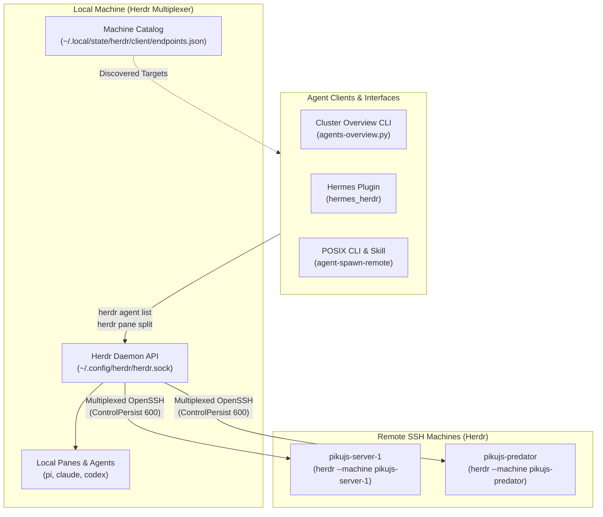

<div align="center">

# Herdr Agent Gateway

**Multi-machine agent overview, dispatch skill, and Hermes plugin for the [Herdr](https://herdr.dev) terminal multiplexer.**

[](LICENSE)
[](https://herdr.dev)
[](flake.nix)
[](https://www.python.org/)

<p align="center">
  <a href="#-overview">Overview</a> •
  <a href="#-architecture">Architecture</a> •
  <a href="#-herdr-in-app-overview-plugin">Herdr Plugin</a> •
  <a href="#-hermes-agent-plugin">Hermes Plugin</a> •
  <a href="#-posix-cli--agent-skill">Agent Skill</a> •
  <a href="#-declarative-nixos--home-manager-configuration">Nix Configuration</a>
</p>

</div>

---

## 🌟 Overview

When working with AI coding agents (Claude Code, OpenCode, Codex, Pi, DSH, Hermes, Antigravity) across multiple machines—local workstations, GPU compute boxes, and CI/dev servers—keeping track of which agent is running where, what project directory it occupies, and its current execution state is challenging.

**Herdr Agent Gateway** unifies your multi-machine agent workflow around **[Herdr](https://herdr.dev)**:

1. **Native OpenSSH Multiplexing**: Built directly upon Herdr's native SSH coordination engine (`herdr --machine <target>`). No custom HTTP daemons, no custom listening ports, and no extra tokens to manage.
2. **Cluster-Wide Agent Overview**: Displays all active agents across local and saved SSH machines in an interactive Herdr overlay pane or terminal table with agent type, lifecycle status, workspace label, terminal title, and working directory (`cwd`).
3. **Hermes Agent Integration**: Declarative plugin for [Hermes Agent](https://github.com/NousResearch/hermes-agent) offering structured tools and slash commands (`/herdr`) to list machines, query cluster agents, and spawn background tasks.
4. **Declarative NixOS & Home Manager Provisioning**: Declaratively define connected SSH machines (`~/.local/state/herdr/client/endpoints.json`), authorized SSH keys, and tool wrappers across all your machines.

---

## 🏗️ Architecture



---

## 🖥️ Herdr In-App Overview Plugin

The gateway includes a lightweight Herdr plugin (`herdr-plugin.toml` & `plugins/herdr-agents-overview/`) that adds cluster-wide agent visibility directly into your Herdr session:

- **Overlay Pane (`placement = "overlay"`)**: Opens a floating, interactive terminal panel showing all running agents across all machines.
- **Actions (`[[actions]]`)**: Provides `overview.list` (formatted table) and `overview.json` (machine-parseable JSON) actions.

### Running the Overview Directly:
```bash
# Print formatted cluster table
herdr-agents-overview

# Show detailed view (including task topic, description, and pane ID)
herdr-agents-overview --detailed

# Output JSON for programmatic tooling
herdr-agents-overview --format json
```

### Example Terminal Output:
```
══ Herdr Multi-Machine Agent Network Overview ══

MACHINE        AGENT TYPE   STATUS     WORKSPACE        TITLE                    DIRECTORY (CWD)
─────────────────────────────────────────────────────────────────────────────────────────────────────────
 local         pi           idle       cordis (wM)      cordis-teach - cordis    /home/pikujs/Projects/ext/ai/agents/dsh/cordis
   └─ topic: cordis | pane: wM:p4
 local         pi           idle       cordis (wM)      dps-task01 - dsh-permis  /home/pikujs/Projects/ai/agents/dsh-plugins/dsh-permission-system
   └─ topic: dps | pane: wM:pA
*local         pi           idle       argus-core (wX)  argus-core               /home/pikujs/Projects/argus/argus-core
   └─ topic: argus | pane: wX:p1
 local         pi           idle       nixos-server-co  nixos-server-config      /home/pikujs/Projects/nixos-server-config
   └─ topic: nixos | pane: w0:pV
 pikujs-pred   claude       running    evals (w1)       model-benchmarks         /srv/evals/benchmarks

Total agents in network: 5
```

---

## 🤖 Hermes Agent Plugin

The repository acts as a native plugin for **Hermes Agent** (`plugin.yaml`, `__init__.py`, `hermes_herdr/`).

### Provided Tools

| Tool Name | Description |
| :--- | :--- |
| `herdr_list_machines` | Lists all configured local and remote SSH machines. |
| `herdr_list_agents` | Lists active agents across the cluster with enriched metadata (`title`, `agent_type`, `cwd`, `workspace_label`, `status`). |
| `herdr_spawn_agent` | Splits a pane on the target machine in a specific directory, launches an agent (`claude`, `codex`, `pi`, `hermes`, etc.), and injects an execution prompt. |
| `herdr_prompt_agent` | Sends follow-up instructions to an active agent in Herdr (with optional `--wait`). |
| `herdr_read_agent` | Reads recent terminal output from an active agent session. |
| `herdr_node_status` | Checks server health and version on a local or remote Herdr host. |

### Slash Commands
- `/herdr machines`: List connected local and remote SSH machines.
- `/herdr agents [machine]`: List active agents formatted with machine, type, title, and directory.
- `/herdr status [machine]`: Inspect server status.
- `/herdr spawn <prompt>`: Quick agent spawn in Herdr.

---

## 📜 POSIX CLI & Agent Skill

The POSIX wrapper `scripts/agent-spawn-remote` (and companion skill [`skills/spawn_herdr_agent/`](skills/spawn_herdr_agent/)) provides a zero-dependency CLI interface for shell-based agent harnesses:

```bash
# List active machines and cluster agents
agent-spawn-remote list machines
agent-spawn-remote list agents

# Spawn an agent on a remote machine in a specific project directory
agent-spawn-remote spawn \
  --machine pikujs-server-1 \
  --cwd /srv/projects/auth-service \
  --kind claude \
  --name auth-refactor \
  --prompt "Refactor database connection pool handling" \
  --wait

# Read output from an agent
agent-spawn-remote read auth-refactor --lines 50

# Close an agent pane
agent-spawn-remote close auth-refactor
```

---

## ❄️ Declarative NixOS & Home Manager Configuration

The gateway provides a declarative Home Manager module (`nix/home-manager-module.nix`) and Nix package derivations.

### 1. Home Manager Configuration
Add `herdr-agent-gateway` to your flake inputs and import the module:

```nix
{
  imports = [ herdr-agent-gateway.homeManagerModules.default ];

  services.herdr-agent-gateway = {
    enable = true;
    client.enable = true;          # Installs agent-spawn-remote CLI
    overviewPlugin.enable = true;  # Links agents-overview plugin into ~/.config/herdr/plugins/
  };
}
```

### 2. Machine Endpoints in Herdr Dotfiles
Herdr manages saved remote machines via `~/.local/state/herdr/client/endpoints.json`. In your NixOS/Home Manager herdr module (`modules/home/herdr.nix`), you can declaratively provision these endpoints:

```nix
{ pkgs, herdr, herdr-agent-gateway, host, ... }:

let
  clusterNodes = [
    { name = "server1"; label = "pikujs-server-1"; target = "pikujs@pikujs-server-1.local"; }
    { name = "pikujs-mini"; label = "pikujs-mini"; target = "pikujs@pikujs-mini.local"; }
    { name = "pikujs-predator"; label = "pikujs-predator"; target = "pikujs@pikujs-predator.local"; }
  ];
  # Exclude current machine
  remoteMachines = builtins.filter (n: n.name != host) clusterNodes;
in
{
  imports = [ herdr-agent-gateway.homeManagerModules.default ];

  home.packages = [ herdr.packages.${pkgs.system}.default ];

  # Configure gateway overview plugin & CLI
  services.herdr-agent-gateway = {
    enable = true;
    client.enable = true;
  };

  # Declaratively configure Herdr remote endpoints
  xdg.stateFile."herdr/client/endpoints.json".text = builtins.toJSON {
    version = 1;
    ssh = map (m: {
      id = builtins.hashString "md5" "${m.target}-default";
      label = m.label;
      target = m.target;
      session = "default";
      enabled = true;
    }) remoteMachines;
  };
}
```

### 3. Declarative Hermes Plugin in NixOS
In your NixOS Hermes module (e.g. `server1/hermes.nix`):

```nix
{ pkgs, hermes-agent, herdr-agent-gateway, herdr, ... }:
{
  services.hermes-agent = {
    enable = true;

    # Declarative plugin installation:
    extraPlugins = [
      herdr-agent-gateway.packages.${pkgs.stdenv.hostPlatform.system}.hermes-plugin
    ];

    settings.plugins.enabled = [ "herdr-agent-gateway" ];

    # Mount herdr CLI into container:
    container.backend = "podman";
  };

  # Automatically bind-mount herdr binary into container at /usr/local/bin/herdr:
  hermesContainerTools = [
    {
      binary = "herdr";
      package = herdr.packages.${pkgs.stdenv.hostPlatform.system}.default;
    }
  ];
}
```

---

## 🔒 Security Model

- **No Public Network Listeners**: Herdr Agent Gateway does not open or listen on any HTTP or TCP ports.
- **OpenSSH Transport**: All remote machine operations travel over standard OpenSSH using your existing `~/.ssh/config` and cryptographic keys.
- **PTY Injection Safety**: Prompts and commands bypass shell evaluation (`bash -c`) and are written directly to PTY streams with bracketed paste.
- **Scoped Execution**: Pane splits and agent launches run under the target host's unprivileged user with standard filesystem permissions.

---

## 📄 License

MIT © [pikujs](https://github.com/pikujs)
